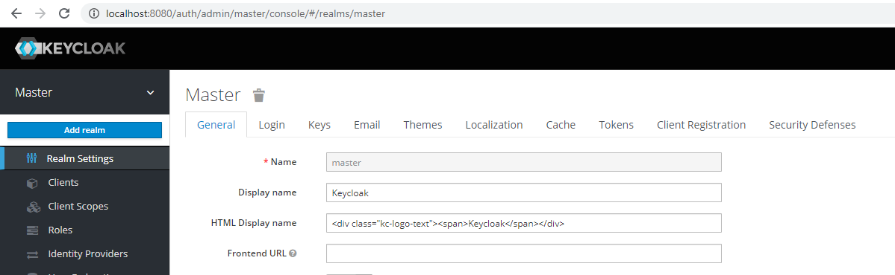
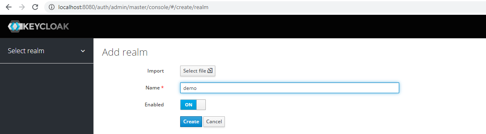
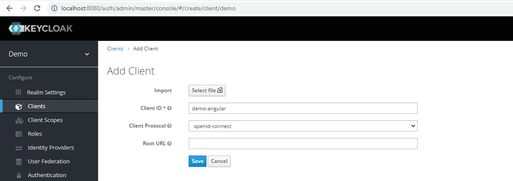
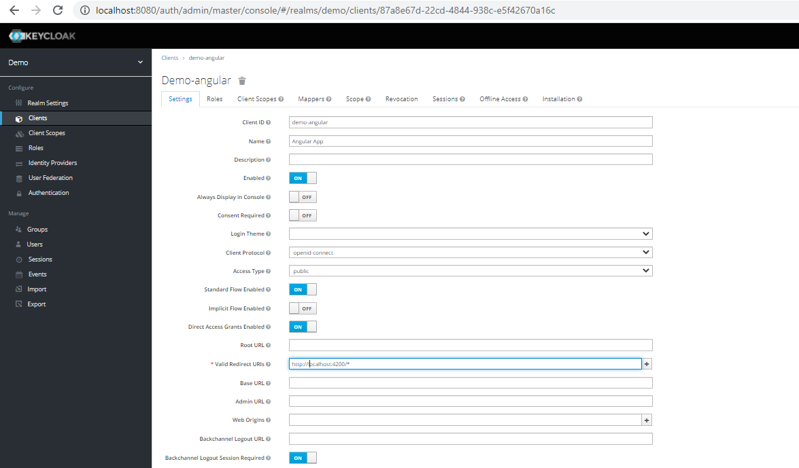
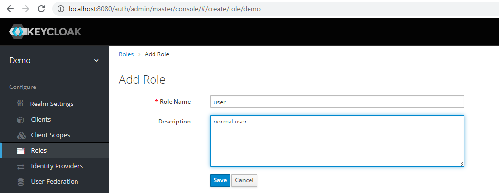
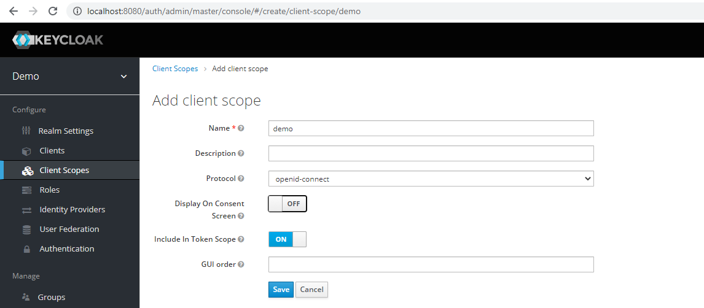
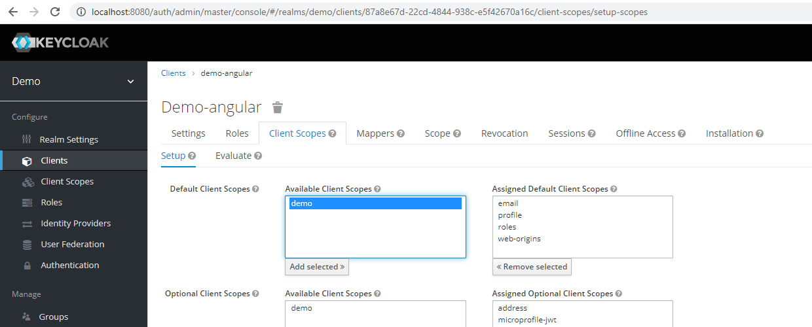
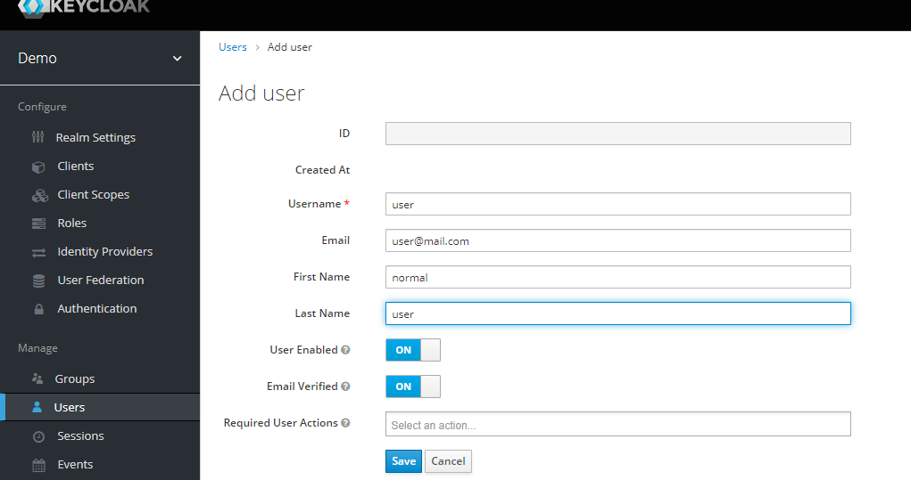
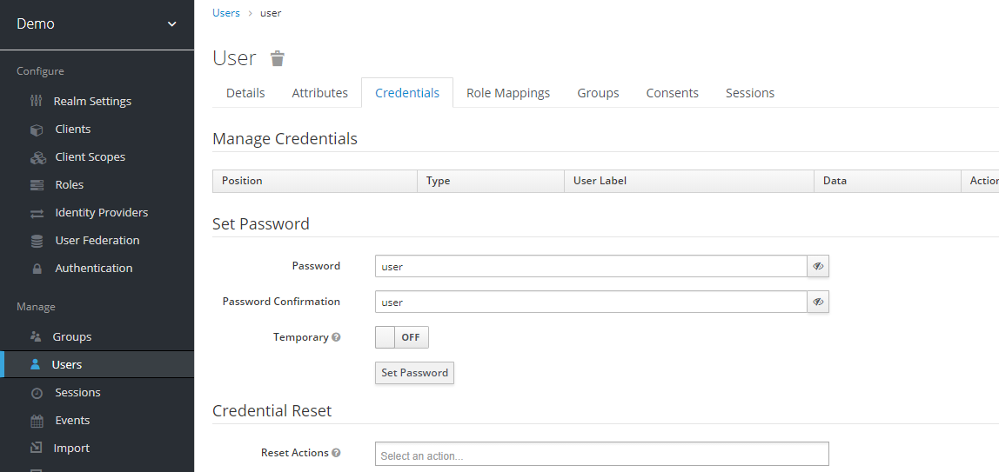

## Keycloak Oauth2 security with Spring rest and angular app
Keycloak as authentication and authorization server which is an open-source identity and access management platform (IAM) from Red Hat’s Jboss.

Features

- Two-factor authentication
- Bruteforce detection
- Social login (Facebook, Twitter, Google…)
- LDAP/AD integration

### Step 1 : Setup Keycloak Server
```sh
# Start the Keycloak and MySql containers
docker-compose -f mysql-keycloak.yml up
```

Open [http://localhost:8080](http://localhost:8080) to access keycloak admin console
- use `admin:admin@123` as credentials

We are now on the pre-defined Master realm. A realm manages a set of users, credentials, roles, and groups. A user belongs to and logs into a realm and they are isolated from one another and can only manage and authenticate the users that they control.

The master realm is the highest level in the hierarchy. Admin accounts in this realm have permissions to view and manage any other realm. It’s best to create a new realm to manage our application and users.


#### Step 1.1 : Add Realms
Add realms/group/domain `demo`





#### Step 1.2 : Add Client


After saving we can see all the configurations



#### Step 1.3 : Add roles


`user,admin`

#### Step 1.4 : Add client scopes


#### Step 1.5 : Add scope to the client


#### Step 1.6 : Add users




`user:user`
`admin:admin`